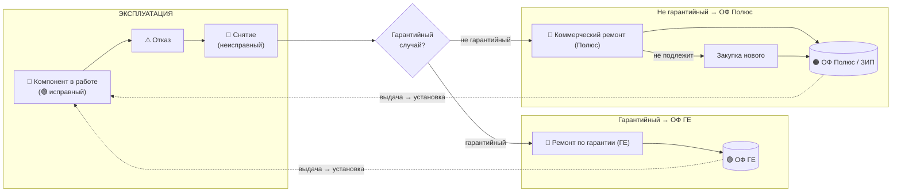

# Оборот оборотных компонентов (rotable pool): методика и схема

> Диаграммы: [[Оборот компонентов (rotable pool).canvas|Canvas]] · снимок `Оборот компонентов (rotable pool).png`

## 1. Что это за модель

Крупные ремонтопригодные компоненты самосвалов NHL — **ДВС, мотор-колесо, силовой генератор** (электропривод NTE) и **ДВС, КПП, бортовой редуктор** (мехпривод TR100) — это **rotables** (оборотные, ремонтопригодные узлы). Они не расходуются, а **циркулируют по замкнутому циклу**:

**ОФ (исправный) → установка на машину → эксплуатация → отказ → снятие (неисправный) → ремонт → возврат в ОФ (исправный) → …**

Чтобы машина не простаивала, применяется **обмен с опережением (advance exchange)**: исправный компонент из оборотного фонда (ОФ) ставится немедленно, а снятый неисправный уходит в ремонт и после восстановления возвращается в фонд.

## 2. Два оборотных фонда и правило владения

| Фонд | Владелец | Когда задействуется | Кто платит за ремонт | Куда возвращается компонент |
|---|---|---|---|---|
| **ОФ ГЕ** | контрагент ГЕ (GE-NHL) | **гарантийный** случай | ГЕ | **обратно в ОФ ГЕ** |
| **ОФ Полюс (ЗИП)** | владелец парка (Полюс) | **не гарантийный** случай | Полюс | **обратно в ОФ Полюс** |

**Правило владения (ключевое):** компонент возвращается в тот же фонд, из которого он был выдан. Отремонтированный по гарантии компонент → в **ОФ ГЕ**; компонент владельца → в **ОФ Полюс**. Фонды не смешиваются.

## 3. Процесс по шагам

0. **Отказ** компонента на самосвале → **снятие** (компонент становится «неисправным»).
1. **Определение гарантийного случая** (развилка).
2. **Выдача исправного из соответствующего ОФ** (ГЕ или Полюс) и **установка на машину** — машина возвращается в работу (advance exchange).
3. **Снятый компонент → ремонт**:
   - гарантийный → **ремонт по гарантии за счёт ГЕ**;
   - не гарантийный → **коммерческий ремонт за счёт Полюс**;
   - если **ремонт невозможен** → закупка нового компонента.
4. **Возврат восстановленного/нового компонента в свой ОФ** — цикл замкнулся. Гарантия на компонент из ОФ ГЕ после ремонта — стандартная.

## 4. Размер оборотного фонда (методика)

Размер ОФ — это классическая задача **rotable pool sizing** (модели METRIC / теорема Палма):

> Число компонентов «в обороте» (в ремонте) ≈ **λ × TAT**, где
> **λ** — интенсивность отказов (отказов в единицу времени по парку),
> **TAT** (turn-around time) — время оборота: снятие → логистика → ремонт → возврат в ОФ.

**Размер ОФ = λ × TAT + страховой запас** (покрытие пиков и задержек ремонта; определяется целевым уровнем сервиса / fill rate).

Практический норматив в модели: **10 самосвалов на гарантии = 1 комплект**
(NTE: 1 ДВС + 2 мотор-колеса + 1 силовой генератор; TR100: 1 ДВС + 1 КПП + 2 бортовых редуктора).
Помесячный расчёт требуемого ОФ по площадкам — в модели `Модель_расчета_оборотных_компонентов_NTE.xlsx`.

**Вывод для планирования:** чем больше TAT (дольше ремонт и логистика), тем больше нужен ОФ. Сокращение TAT напрямую уменьшает требуемый оборотный фонд.

## 5. Открытые вопросы
- Закупка при невозможности ремонта — у ГЕ или у стороннего поставщика?
- Первичное формирование фондов (кто и в каком объёме закупает ОФ ГЕ и ОФ Полюс на старте).
- Фактический TAT по каждому типу компонента (нужен для точного размера ОФ вместо норматива 10:1).

## 6. Диаграмма (Mermaid)

## Источники по методике
- Rotable pool / closed-loop repairable spares — SCOR Best Practice 168; aviation MRO practice.
- Pool sizing по TAT и интенсивности отказов — METRIC / теорема Палма (число в ремонтном конвейере ~ Пуассон со средним λ·TAT).
