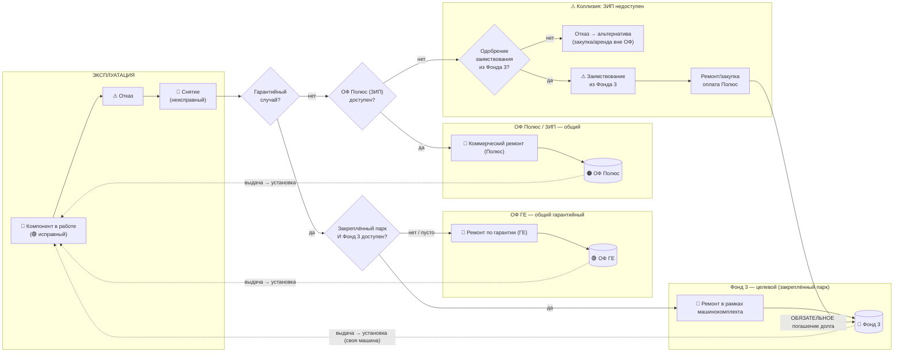

# Оборот оборотных компонентов (rotable pool): методика и схема

> Диаграммы: [[Оборот компонентов (rotable pool).canvas|Canvas, 2 фонда]] · [[Оборот компонентов — 3 фонда (коллизия).canvas|Canvas, 3 фонда + коллизия]] · снимки `Оборот компонентов (rotable pool).png`, `Оборот компонентов — 3 фонда (коллизия).png`

## 1. Что это за модель

Крупные ремонтопригодные компоненты самосвалов NHL — **ДВС, мотор-колесо, силовой генератор** (электропривод NTE) и **ДВС, КПП, бортовой редуктор** (мехпривод TR100) — это **rotables** (оборотные, ремонтопригодные узлы). Они не расходуются, а **циркулируют по замкнутому циклу**:

**ОФ (исправный) → установка на машину → эксплуатация → отказ → снятие (неисправный) → ремонт → возврат в ОФ (исправный) → …**

Чтобы машина не простаивала, применяется **обмен с опережением (advance exchange)**: исправный компонент из оборотного фонда (ОФ) ставится немедленно, а снятый неисправный уходит в ремонт и после восстановления возвращается в фонд.

**Ремонтный цех ГЕ — единая ремонтная база.** Физический ремонт по всем веткам (гарантийный за счёт ГЕ, гарантийный в рамках машинокомплекта, коммерческий за счёт Полюс) выполняется **на одной и той же площадке ГЕ** — это специализированный ремонт крупных узлов (ДВС, мотор-колесо, генератор, КПП, бортовой редуктор), недоступный сторонним мастерским. Различаются только **условия оплаты** и **фонд, в который компонент возвращается после ремонта** — сам цех один.

## 2. Три оборотных фонда и правило владения

| Фонд | Владелец | Когда задействуется | Кто платит за ремонт | Куда возвращается компонент |
|---|---|---|---|---|
| **ОФ ГЕ** | контрагент ГЕ (GE-NHL) | **гарантийный** случай, весь парк | ГЕ | **обратно в ОФ ГЕ** |
| **Фонд 3 — ОФ Клиента (целевой / машинокомплект)** | владелец парка (Полюс) | **только гарантийный** случай, **только на закреплённом парке машин** | по условиям поставки (компонент включён в комплект машины) | **обратно в Фонд 3** |
| **ОФ Полюс (ЗИП)** | владелец парка (Полюс) | **не гарантийный** случай, весь парк | Полюс | **обратно в ОФ Полюс** |

**Фонд 3 — что это и откуда взялся.** При поставке определённой партии машин в комплект поставки были включены оборотные компоненты («машинокомплект» ЗИП). Юридически они принадлежат клиенту (Полюс), но по условиям поставки предназначены **исключительно для гарантийного обслуживания именно тех машин**, с которыми поставлены. Это не отдельный склад «на всякий случай», а **целевой, контрактно обособленный актив**.

**Правило владения (ключевое):** компонент возвращается в тот же фонд, из которого был выдан. Отремонтированный по гарантии компонент из ОФ ГЕ → в **ОФ ГЕ**; из Фонда 3 → в **Фонд 3**; компонент владельца из ЗИП → в **ОФ Полюс**. Фонды физически и учётно не смешиваются — это и есть источник коллизии, разобранной в разделе 5.

## 3. Процесс по шагам (с приоритетом фондов)

0. **Отказ** компонента на самосвале → **снятие** (компонент становится «неисправным»).
1. **Гарантийный случай?**
   - **Да** → 2а. Проверка: **машина входит в закреплённый парк (машинокомплект) И в Фонде 3 есть исправный компонент?**
     - Да → выдача из **Фонда 3**, ремонт снятого «в рамках машинокомплекта» за счёт условий поставки, возврат — в **Фонд 3**.
     - Нет (машина не из закреплённого парка, либо Фонд 3 пуст) → выдача из **ОФ ГЕ** (общий гарантийный фонд-подстраховка), ремонт за счёт ГЕ, возврат — в **ОФ ГЕ**.
   - **Нет** → 2б. Проверка: **ОФ Полюс (ЗИП) доступен?**
     - Да → выдача из **ОФ Полюс**, коммерческий ремонт за счёт Полюс, возврат — в **ОФ Полюс**.
     - Нет → **коллизия** (см. раздел 5).
3. Если ремонт снятого компонента невозможен — закупка нового вместо ремонта; логика возврата в фонд не меняется.
4. Возврат восстановленного/нового компонента **в тот фонд, откуда был выдан заменяющий** — цикл замкнулся.

На схеме «3 фонда (коллизия)» оба встречных потока показаны явно и разным цветом: 🔴 **красным** — путь снятого (неисправного) компонента от машины через решение о гарантии до ремонта; **пунктиром цвета фонда** — выдача исправного компонента из ОФ и установка на машину (advance exchange); **сплошной линией цвета фонда** — возврат отремонтированного/нового компонента в тот же фонд.

## 4. Коллизия: Фонд 3 используется для не гарантийного случая

**Ситуация.** ОФ Полюс (ЗИП) пуст или недоступен, а на закреплённой машине физически стоит доступный компонент из Фонда 3 — единственный вариант не остановить самосвал. Использование компонента, ограниченного «только гарантия», для не гарантийного случая нарушает условия, на которых Фонд 3 получен, и «протыкает» целевой фонд, оставляя его без покрытия на случай реальной гарантийной поломки на закреплённых машинах.

Это стандартная для управления **обособленными (earmarked / dedicated) складами** проблема — «cross-utilization» между целевым и общим фондом. Решение из практики MRO/SCM для такого рода consigned-инвентаря — трактовать использование не по назначению как **управляемое исключение с обязательным восполнением («make-whole»)**, а не как обычную выдачу.

### Рекомендуемое решение — 4 элемента контроля

1. **Приоритет доступа (waterfall).** Фонд 3 — не является нормальным источником для не гарантийных случаев. Он подключается только после проверки «ОФ Полюс недоступен» — т.е. это резерв последней очереди, а не альтернатива ЗИП.
2. **Гейт авторизации.** Списание из Фонда 3 на не гарантийный случай требует **явного одобрения** (ответственное лицо/регламент), а не выполняется автоматически кладовщиком — это единственный способ не дать целевому фонду «незаметно» истощаться.
3. **Обязательное погашение долга (mandatory make-whole) — в тот же фонд.** Как только компонент из Фонда 3 израсходован на сторону, немедленно открывается **долг Фонда 3**: не гарантийный случай оплачивается на общих коммерческих основаниях (Полюс), но восстановленный/новый компонент возвращается **не в ЗИП, а именно в Фонд 3** — иначе учётная и физическая целостность целевого фонда для закреплённых машин будет подорвана.
4. **Реестр и алерт.** По Фонду 3 ведётся отдельный учёт: **норматив** (по числу закреплённых машин и условиям поставки), **факт** на складе, **долг** (единиц, заимствованных и ожидающих погашения). Пока долг не закрыт, фонд считается дефицитным: если в этот период возникает настоящий гарантийный случай на закреплённой машине, его нужно эскалировать в ОФ ГЕ (по правилу «Фонд 3 пуст → ОФ ГЕ» из раздела 3).

### Альтернативные варианты (для сравнения)
- **Жёсткий запрет** — Фонд 3 вообще нельзя использовать для не гарантийных случаев ни при каких условиях. Проще в учёте, но снижает доступность запчастей в дефицитные периоды и может остановить машину при пустом ЗИП.
- **Только финансовая компенсация** — не гарантийный случай оплачивает стоимость единицы в бюджет владельца без физического возврата именно в Фонд 3 (пополнение из общей закупки). Проще администрировать, но не гарантирует, что закупка вообще произойдёт вовремя и что она попадёт именно в Фонд 3, а не осядет в ЗИП — риск фактической эрозии целевого фонда.

Рекомендуется основной вариант (4 элемента выше) как баланс между доступностью и сохранностью целевого фонда.

## 5. Размер оборотного фонда (методика)

Размер ОФ — это классическая задача **rotable pool sizing** (модели METRIC / теорема Палма):

> Число компонентов «в обороте» (в ремонте) ≈ **λ × TAT**, где
> **λ** — интенсивность отказов (отказов в единицу времени по парку),
> **TAT** (turn-around time) — время оборота: снятие → логистика → ремонт → возврат в ОФ.

**Размер ОФ = λ × TAT + страховой запас** (покрытие пиков и задержек ремонта; определяется целевым уровнем сервиса / fill rate).

Практический норматив в модели: **10 самосвалов на гарантии = 1 комплект**
(NTE: 1 ДВС + 2 мотор-колеса + 1 силовой генератор; TR100: 1 ДВС + 1 КПП + 2 бортовых редуктора).
Помесячный расчёт требуемого ОФ по площадкам — в модели `Модель_расчета_оборотных_компонентов_NTE.xlsx`.

**Вывод для планирования:** чем больше TAT (дольше ремонт и логистика), тем больше нужен ОФ. Сокращение TAT напрямую уменьшает требуемый оборотный фонд.

**Фонд 3** нормируется иначе, чем ОФ ГЕ/ОФ Полюс: его размер не считается по формуле λ×TAT от всего парка, а **фиксируется условиями поставки** — по числу и составу закреплённых машин (машинокомплект). Формула λ×TAT применима к нему только в границах этого закреплённого подпарка, если потребуется досчитать достаточность норматива.

## 6. Открытые вопросы
- Закупка при невозможности ремонта — у ГЕ или у стороннего поставщика?
- Первичное формирование фондов (кто и в каком объёме закупает ОФ ГЕ и ОФ Полюс на старте).
- Фактический TAT по каждому типу компонента (нужен для точного размера ОФ вместо норматива 10:1).
- **Перечень и количество машин/компонентов, закреплённых за Фондом 3** — нужны исходные данные (какие машины, какой машинокомплект), чтобы точно посчитать норматив и текущий факт.
- Кто утверждает исключение (гейт авторизации из раздела 4) — конкретная роль/регламент.

## 7. Диаграмма (Mermaid, 3 фонда + коллизия)

## Источники по методике
- Rotable pool / closed-loop repairable spares — SCOR Best Practice 168; aviation MRO practice.
- Pool sizing по TAT и интенсивности отказов — METRIC / теорема Палма (число в ремонтном конвейере ~ Пуассон со средним λ·TAT).
- Обособленные/целевые (dedicated, earmarked, consigned) запасы, закреплённые за конкретным контрактом или flotом — практика авиационного MRO по tail-number-bound rotables; управление межфондовым заимствованием (cross-utilization) через гейт авторизации и обязательное восполнение (make-whole) — общая практика управления запасами с hard allocation.
