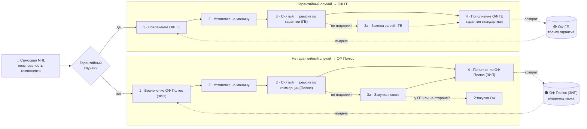

# Ремонт компонентов через контрагента ГЕ (GE-NHL) — работа с оборотными фондами

> Схема-диаграмма: [[Схема ремонта компонентов ГЕ (оборотные фонды).canvas|открыть Canvas]]

## Суть

При неисправности крупного компонента самосвала (ДВС, мотор-колесо, силовой генератор — для NTE; ДВС, КПП, бортовой редуктор — для TR100) машина не должна простаивать. Поэтому неисправный компонент **сразу меняется на исправный из оборотного фонда (ОФ)**, а снятый уходит в ремонт и затем возвращается в фонд.

Есть **два независимых оборотных фонда**:

| Фонд | Владелец | Назначение |
|---|---|---|
| **ОФ ГЕ** | контрагент ГЕ (GE-NHL) | **только гарантийные случаи** |
| **ОФ Полюс (ЗИП)** | владелец парка (Полюс) | любые случаи (в первую очередь негарантийные) |

Ключевая развилка — **гарантийный случай или нет**: от неё зависит, **чей компонент вовлекается** из фонда и **за чей счёт ремонтируется** снятый.

## Процесс по шагам

**0. Событие.** Самосвал → неисправность компонента → **определение гарантийного случая**.

### А. Гарантийный случай → ОФ ГЕ
1. **Вовлечение ОФ ГЕ** — на машину ставится исправный компонент из фонда ГЕ (за счёт ГЕ).
2. **Установка на машину** — самосвал возвращается в работу.
3. **Снятый компонент → ремонт по гарантии** (за счёт ГЕ).
   - *3а.* Если ремонт невозможен — замена компонента за счёт ГЕ.
4. **Пополнение ОФ ГЕ** — отремонтированный/новый компонент возвращается в фонд ГЕ. Гарантия на компонент после ремонта — **стандартная**.

### Б. Не гарантийный случай → ОФ Полюс (ЗИП)
1. **Вовлечение ОФ Полюс (ЗИП)** — на машину ставится исправный компонент из фонда владельца.
2. **Установка на машину** — самосвал возвращается в работу.
3. **Снятый компонент → ремонт по коммерции** (оплата Полюс).
   - *3а.* Если ремонт невозможен — закупка нового компонента.
4. **Пополнение ОФ Полюс (ЗИП)** — компонент возвращается в фонд владельца.

## Открытые вопросы (требуют решения)
- ❓ **Закупка ОФ при невозможности ремонта** — покупать у ГЕ или у стороннего поставщика?
- ❓ **Первичное формирование фондов** — кто и в каком объёме закупает ОФ ГЕ и ОФ Полюс на старте эксплуатации парка? (Норматив объёма фонда рассчитан в модели «Оборотный фонд компонентов»: 10 самосвалов на гарантии = 1 комплект.)

## Диаграмма

